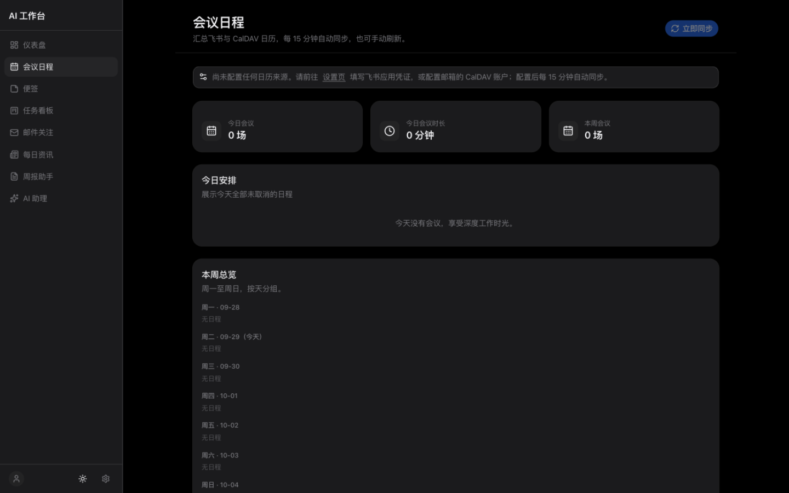
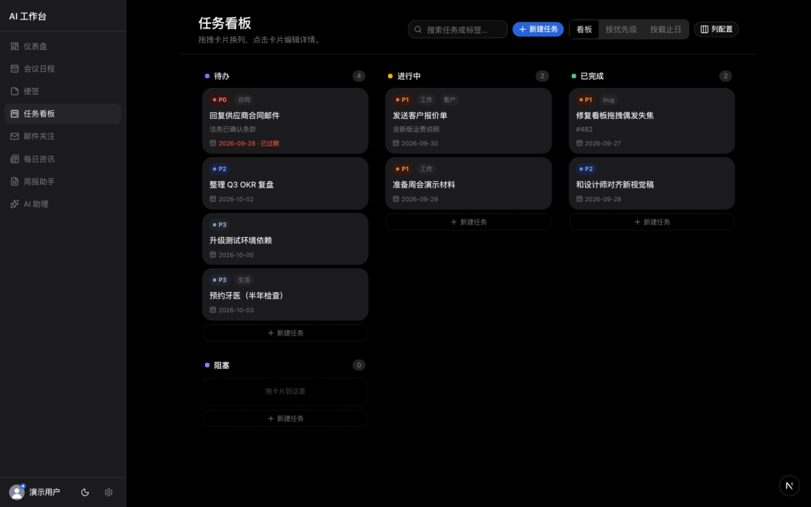
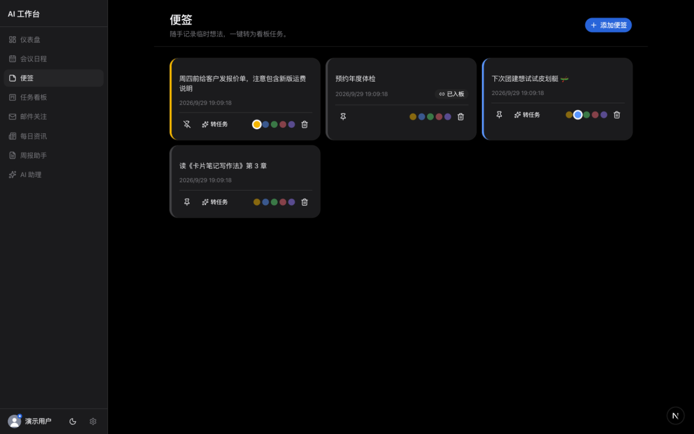
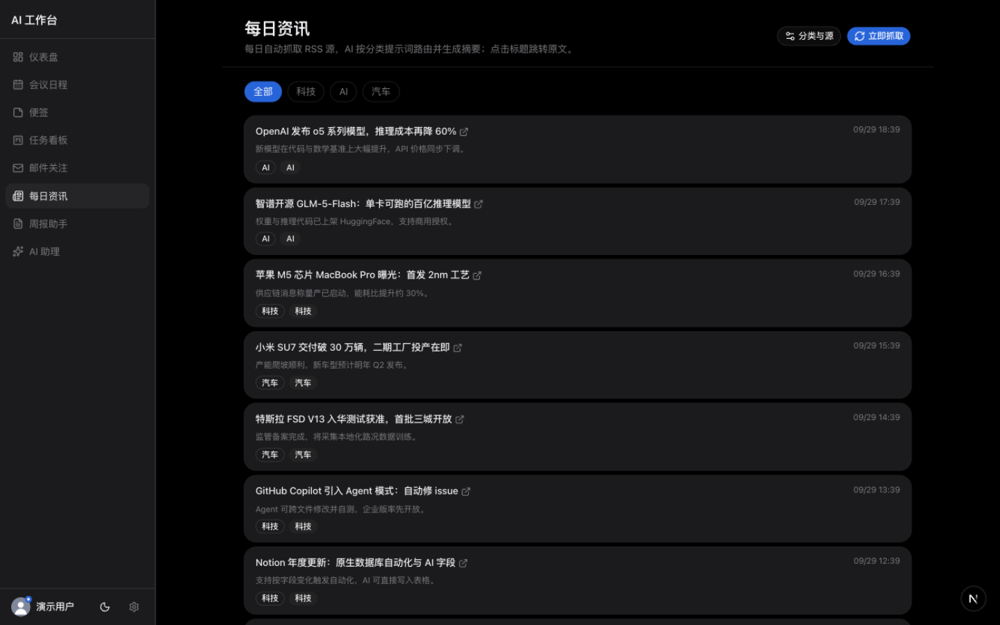
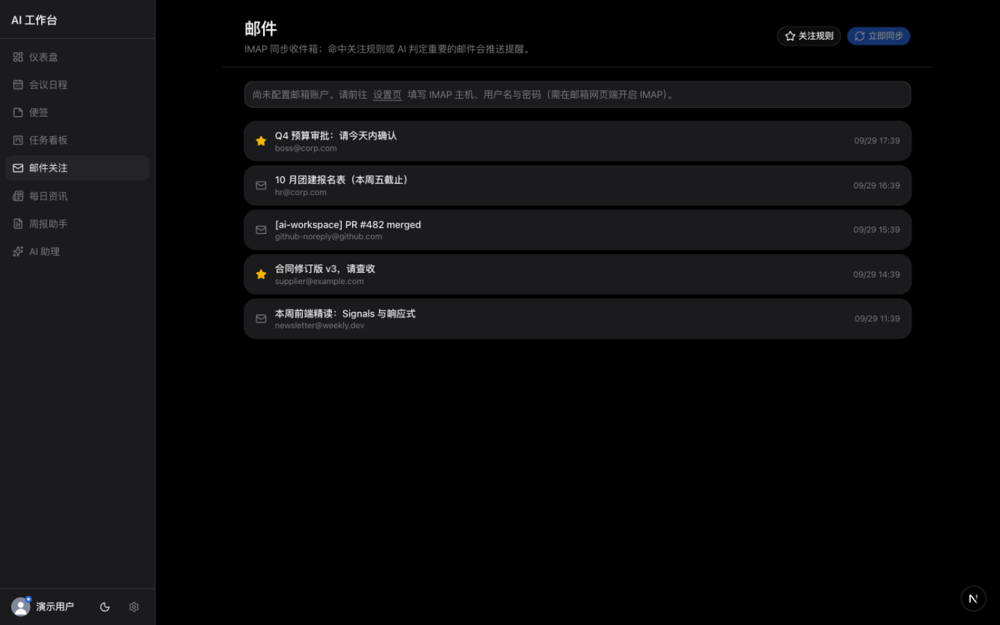
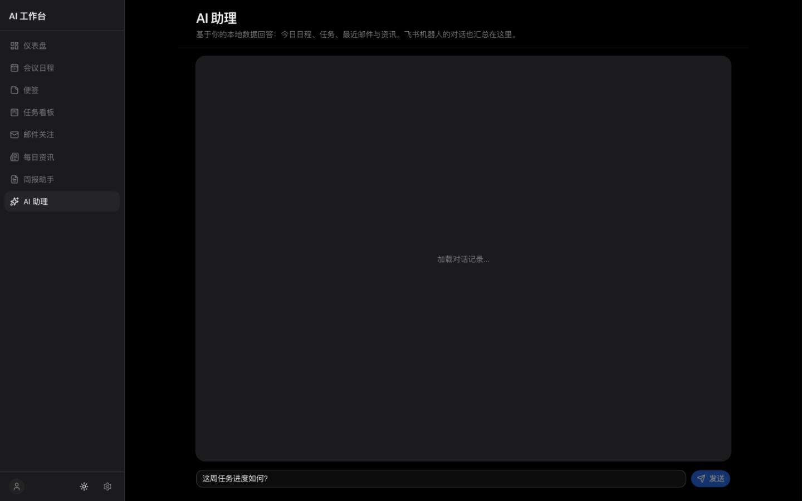
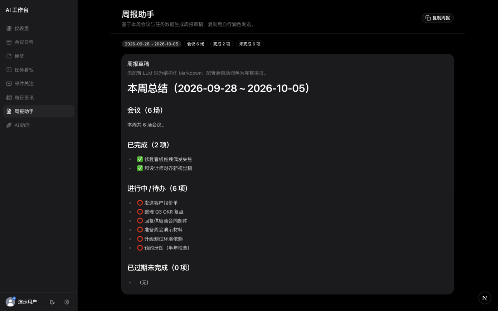
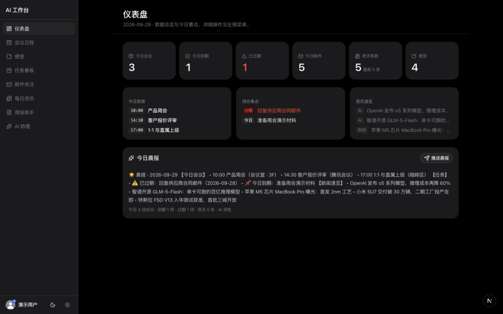

# AI 工作台

**跑在你自己电脑上的私人办公助理**

日程 · 任务 · 资讯 · 邮件 · 提醒 —— 数据全部留在本机，AI 能力由你自己的大模型接口驱动

macOS / Windows / Linux · 中文界面 · 暗色模式 · 无订阅、无云端、无遥测

[在线介绍页](https://leisurehuang.github.io/ai-workspace-release/) · [下载安装](#下载安装) · [功能一览](#功能一览) · [数据与隐私](#数据与隐私) · [常见问题](#常见问题)

  

## 下载安装

| 平台 | 下载 | 说明 |
|---|---|---|
| macOS（Apple 芯片） | [ai-workspace-arm64.dmg](https://github.com/leisurehuang/ai-workspace-release/releases/latest/download/ai-workspace-arm64.dmg) | M1/M2/M3/M4 系列 |
| macOS（Intel 芯片） | [ai-workspace-x64.dmg](https://github.com/leisurehuang/ai-workspace-release/releases/latest/download/ai-workspace-x64.dmg) | 旧款 Intel Mac |
| Windows | [ai-workspace-setup.exe](https://github.com/leisurehuang/ai-workspace-release/releases/latest/download/ai-workspace-setup.exe) | NSIS 安装器（x64） |
| Linux (AppImage) | [ai-workspace-linux-x86_64.AppImage](https://github.com/leisurehuang/ai-workspace-release/releases/latest/download/ai-workspace-linux-x86_64.AppImage) | 下载后 `chmod +x` 直接运行 |
| Linux (deb) | [ai-workspace-linux-amd64.deb](https://github.com/leisurehuang/ai-workspace-release/releases/latest/download/ai-workspace-linux-amd64.deb) | Debian / Ubuntu 系 |

> 全部版本历史见 [Releases](https://github.com/leisurehuang/ai-workspace-release/releases)。

> 未做代码签名（个人项目）：**macOS** 首次打开请右键安装包 →「打开」，或安装后在终端执行
> `xattr -cr "/Applications/AI Workspace.app"`；**Windows** SmartScreen 提示时选择「仍要运行」。

## 功能一览

| 模块 | 能力 |
|---|---|
| 📅 **会议日程** | 同步飞书日历：今日时间轴、本周总览、会议统计，会前自动提醒 |
| 🗒 **便签** | 随手记录、置顶、颜色标记，一键让 AI 解析成任务（标题/优先级/截止日） |
| 📋 **任务看板** | 可配置列、拖拽流转、P0-P3 优先级、标签、过期高亮、三种视图 |
| 📰 **每日资讯** | RSS 抓取 + AI 分类与一句话摘要；自定义分类只需写一段提示词 |
| 📧 **邮件关注** | IMAP 同步收件箱，关注规则 + AI 重要性打分，重要邮件主动推送 |
| 🔔 **AI 助理** | 每日晨报（日程+任务+资讯聚合）、周报草稿、基于本地数据的对话问答 |

提醒三渠道触达：站内通知中心 + 浏览器系统通知 + 飞书机器人私聊。规则引擎每分钟运行、去重幂等——像一个真正的私人助理，而不是一堆需要你去看的列表。

## 界面一览

| | |
|---|---|
|  |  |
| **会议日程** · 今日/本周/统计 | **任务看板** · 拖拽/优先级/过期高亮 |
|  |  |
| **便签** · AI 一键转任务 | **每日资讯** · 提示词自定义分类 |
|  |  |
| **邮件关注** · 规则 + AI 打分 | **AI 助理** · 本地数据问答 |
|  |  |
| **周报助手** · 一键生成草稿 | **暗色模式** · 全局支持 |

## 数据与隐私

- **本地优先**：全部数据存在本机 SQLite，密钥（大模型 API Key、飞书/邮箱凭证）以 AES-256-GCM 加密落盘
- **自带模型**：任意 OpenAI 兼容接口（智谱 / DeepSeek / Kimi / 火山方舟 / OpenAI…）均可接入，base_url / model / key 全部可配
- **无遥测、无账号、无订阅**：应用不会向任何第三方上报数据；唯一的出站请求发往你自己配置的服务
- **备份与迁移**：数据存于系统标准应用数据目录（mac `~/Library/Application Support/AI Workspace`、win `%APPDATA%\AI Workspace`、linux `~/.config/AI Workspace`），拷贝该目录即完成迁移

## 快速上手

1. 安装并启动应用
2. 进入「设置」配置大模型接口（必配，驱动全部 AI 能力）
3. 按需配置飞书（日历/推送/速记）与邮箱（IMAP）凭证——不配置的功能会自动降级，应用照常可用

## 常见问题

**为什么不开放源码？**
个人项目，源码暂不开放。安装包无任何混淆加壳，本地数据格式为标准 SQLite，可随时用任意工具查看与导出——不信黑盒，信透明数据。

**断网能用吗？**
日程、任务、便签、历史资讯等本地数据功能完全可用；AI 摘要/问答与外部同步（飞书/邮箱/RSS）需要网络。

**升级会丢数据吗？**
不会。数据目录独立于应用本体，覆盖安装自动继承全部数据。

## License

二进制按 [MIT](LICENSE) 授权分发。
